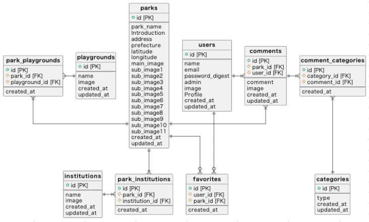
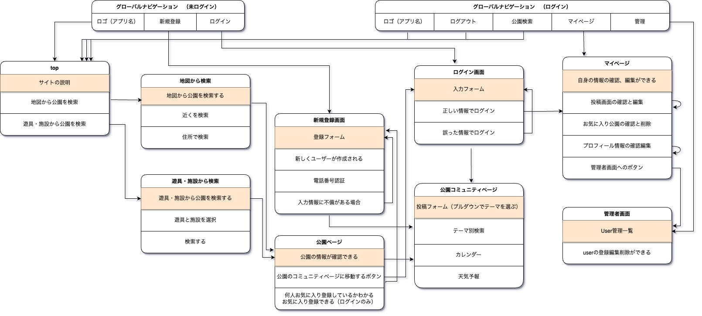

# README

# 開発言語
* Ruby3.0.4
* Rails6.1.6

<br>

# 就職Termの技術

* rails_admin
* お気に入り機能
* Ajaxによるコメント機能
* OAuthによるGoogleログイン機能

<br>

# カリキュラム外の技術
* ransackによる検索機能

<br>

# 実行手順
```
$ git clone git@github.com:kanekorei33/como_app.git
$ cd como_app
$ bundle
$ rails db:create && rails db:migrate
$ rails s
```

<br>

# カタログ設計
https://docs.google.com/spreadsheets/d/1nhSXbNsuatUEeAiULUpoDlXjt1I1HQIeGpQiNAahQC4/edit?usp=sharing

<br>

# テーブル定義書
https://docs.google.com/spreadsheets/d/1nhSXbNsuatUEeAiULUpoDlXjt1I1HQIeGpQiNAahQC4/edit?usp=sharing

<br>

# ワイヤーフレーム
https://prottapp.com/app/#/projects/62f1cd7e86e4657181797c76

<br>

# ER図


<br>

# 画面遷移図
